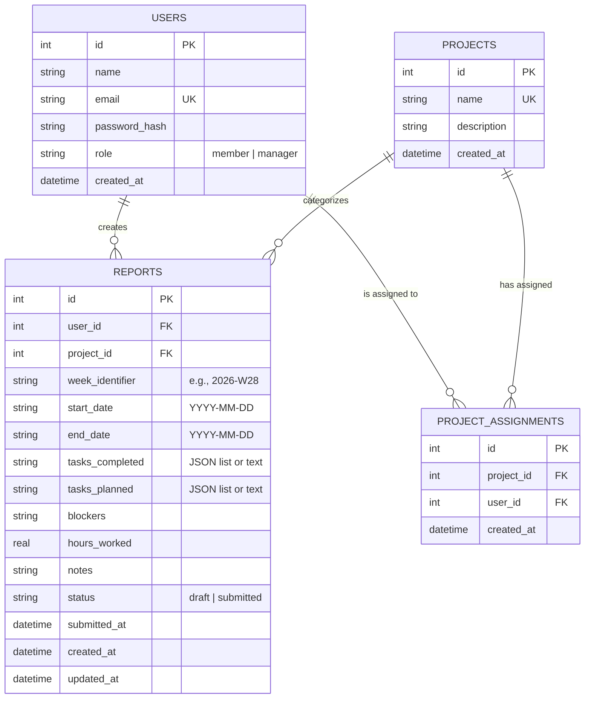

# Weekly Report Generator & Team Dashboard

A premium, full-stack web application designed for team members to submit structured weekly work reports and managers to analyze team progress, track compliance, and consult an AI assistant.

---

## 🛠️ Technology Stack

- **Frontend**: React (Vite) + Vanilla CSS (for glassmorphism UI/UX) + Recharts (data graphics) + Lucide Icons.
- **Backend**: Node.js + Express.js + JSON Web Tokens (session handling).
- **Database**: SQLite (local, file-based relational store).
- **AI Integration**: Google Gemini API with smart local mock capabilities.

---

## 🚀 Setup & Execution Instructions

Follow these simple steps to run the application on your local machine:

### 1. Prerequisites
Ensure you have **Node.js** (v18 or higher) and **npm** installed. You can check your version by running:
```bash
node -v
npm -v
```

### 2. Installing Dependencies
From the root project directory, run the following command to automatically install all dependencies for the root coordinator, backend, and frontend folders:
```bash
npm run install:all
```
*Note: This command resolves dependencies for all directories and handles any peer conflicts related to React 19 automatically.*

### 3. Configuring the Environment & AI Key
Go to the `backend/` directory, copy the template file, and populate your details:
```bash
cd backend
cp .env.example .env
```
Inside the `.env` file, you can set your **Gemini API Key**:
```env
PORT=5000
JWT_SECRET=your_jwt_secret_key
GEMINI_API_KEY=AIzaSy... # Optional: Paste your Google Gemini API Key here
USE_MOCK_AI=false        # Set to true to force local mock mode even if API key is provided
```
*If no API key is provided, the application runs in **Mock Intelligent Mode**, parsing local reports data to provide realistic AI chat interactions.*

### 4. Running the Relational Database
Since this project uses **SQLite**, the database is a local file (`backend/database.sqlite`). You **do not** need to install or run a separate database server.
- The backend server **automatically creates the tables and seeds mock data** upon its very first launch!
- If you ever want to re-seed or manually seed the database, run:
```bash
npm run seed --prefix backend
```

### 5. Running the Application
To launch the backend API server (port 5000) and the frontend React application (port 5173) concurrently, run:
```bash
npm run dev
```

Open your browser and navigate to:
👉 **[http://localhost:5173](http://localhost:5173)**

---

## 👥 Demo Logins

The database is seeded with the following user accounts for immediate testing:

### Manager Portal (Full dashboard access, project creator, AI assistant)
- **Email**: `manager@example.com`
- **Password**: `manager123`

### Team Member Portal (Report editor and history lists)
- **Email**: `bob@example.com` (Client A & R&D assignments)
- **Password**: `member123`
- **Email**: `charlie@example.com` (Client A & Internal Tooling assignments)
- **Password**: `member123`
- **Email**: `dave@example.com` (Marketing Website & R&D assignments)
- **Password**: `member123`

*Note: You can also register a brand new account and select either Team Member or Manager role directly during signup.*

---

## 📊 Relational Database Schema (ER Diagram)

The database schema is structured as follows:


